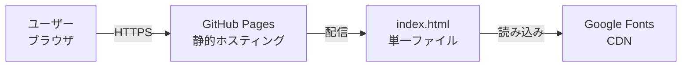

# インフラ構成図

## システム構成

## 環境一覧

| 環境 | URL | ホスティング | 用途 |
|------|-----|-------------|------|
| 本番 | https://mokimonogakari.github.io/awamori-recommend/ | GitHub Pages | 公開環境 |
| ローカル | file:// または localhost | ローカルPC | 開発・テスト |

## 使用サービス一覧

| サービス | 用途 | プラン |
|----------|------|--------|
| GitHub Pages | 静的サイトホスティング | Free |
| Google Fonts | Webフォント配信 | Free |

## ネットワーク・セキュリティ

- GitHub Pages による HTTPS 自動提供
- サーバーサイド処理なし（攻撃対象面が最小）
- ユーザーデータの収集・保存なし
- CORS 設定不要（外部API呼び出しなし）
